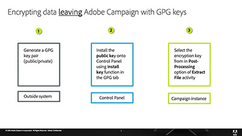

# Control Panel -  Overview

Control Panel allows Adobe Campaign administrators to monitor key assets and perform administrative tasks, such as managing the SFTP storage by instance, allow listing IP addresses, or managing GPG keys.

## Staff Picks

<table>
<tr>
<td>
    
    

      <a href="./get-started.md">
    <strong>Get started with Control Panel</strong>
    </a>
    

    

    <em>Learn how to access the Control Panel and what the prerequisites are to be able to work with the control panel. </em>
    

  </td>
  <td>
    
    

      <a href="./instance-settings/gpg-key-management/generate-and-install-gpg-keys.md">
    <strong>Generate and install GPG keys for data encryption</strong>
    </a>
    

    

    <em>Learn how to connect to your SFTP server using a client SFTP application, using the keys you have stored in the Control Panel. </em>
    

  </td>
  <td>
    
    

      <a href="./sftp-management/connect-to-sftp-server.md">
    <strong>Connecting to an SFTP Server</strong>
    </a>
    

    

    <em>Learn how to connect to your SFTP server using a client SFTP application, using the keys you have stored in the Control Panel. </em>
    

  </td>
</tr>
</table>

## Additional resources

* [Control Panel Help Center](https://experienceleague.adobe.com/docs/control-panel/using/control-panel-home.html?lang=en)
