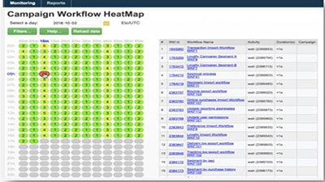
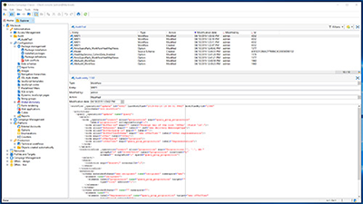
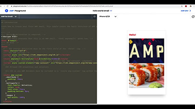

# Adobe Campaign V8 Tutorials - Overview

Adobe Campaign provides a platform for designing cross-channel customer experiences and provides an environment for visual campaign orchestration, real time interaction management and cross channel execution. This user guide contains videos and tutorials on the many features and capabilities of Adobe Campaign V8.

>[!NOTE]
> Campaign v8 is currently only available as a Managed Cloud Service, and cannot be deployed on an on-premise or hybrid environments. Migration from an existing Campaign Classic v7 environment is not yet available.
>Please see the [Classic v7 to V8 product documentation](https://experienceleague.corp.adobe.com/docs/campaign/campaign-classic/start/capability-matrix.html?lang=en#start) for more information about the differences of the two versions. Also see the [Campaign Classic V7 tutorials](https://experienceleague.adobe.com/docs/campaign-classic-learn/tutorials/overview.html) section for how to videos.

## What's New

[Key capabilities](https://experienceleague.adobe.com/docs/campaign/campaign-classic/start/whats-new.html?lang=en#start)

## Staff Picks

<table>
<tr>
  <td>
    
    

      <a href="./monitoring/workflow-heatmap.md">
    <strong>Workflow Heatmaps</strong>
    </a>
    

    

    <em>Get an overview on the number of concurrent workflows.</em>
    

  </td>
   <td>
    
    

      <a href="./monitoring/audit-trail.md">
    <strong>Audit Trail</strong>
    </a>
    
 
    

    <em>Capture a comprehensive list of actions and events occurring within Adobe Campaign.</em>
    

  </td>
  <td>
    
    

      <a href="./sending-messages/email-channel/defining-interactive-email-content-with-amp.md">
    <strong>Defining Interactive Email Content with AMP</strong>
    </a>
    

    

    <em>Learn how to activate and use AMP in Adobe Campaign Classic </em>
    

  </td>
</tr>
</table>

## Additional resources

* [Documentation](https://experienceleague.adobe.com/docs/campaign/campaign-classic/campaign-home.html)
